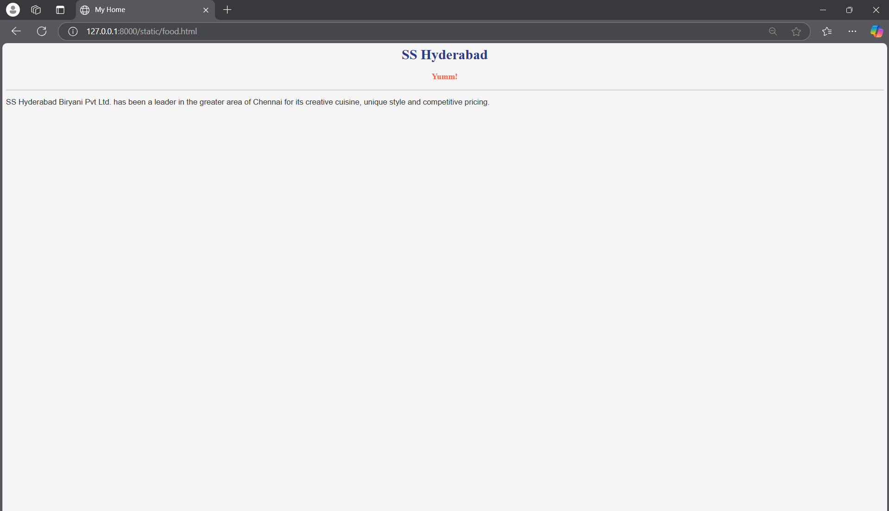

# Ex04 Places Around Me
## Date: 

## AIM
To develop a website to display details about the places around my house.

## DESIGN STEPS

### STEP 1
Create a Django admin interface.

### STEP 2
Download your city map from Google.

### STEP 3
Using ```<map>``` tag name the map.

### STEP 4
Create clickable regions in the image using ```<area>``` tag.

### STEP 5
Write HTML programs for all the regions identified.

### STEP 6
Execute the programs and publish them.

## CODE
```
"map.html"

    <head>
        <title>My City</title>
    </head>
    <body>
        <h1 allign="center">
            <font color="red"><center><b>IOC</b></font></center>
        </h1>
        <h3 allign="center">
            <font color="blue"><center><b>Darshini B(24008783)</b></font></center>
        </h3>
        <center>
            
            <map name="MyCity">
                <area shape="rect" coords="970,720,1101,817" href="home.html" title="My Home Town">
                <area shape="rect" coords="736,726,976,863" href="beach.html" title="VR Mall">
                <area shape="rect" coords="698,856,938,993" href="shop.html" title="Rohini Theatre">
                <area shape="rect" coords="1062,632,1250,725" href="food.html" title="Kora Food Street">
                <area shape="rect" coords="1323,589,1511,682" href="pool.html" title="Anna Tower Park">
            </map>
        </center>
    </body>
</html>

"home.html"

<html>
<head>
<title>My Home</title>
</head>
<body bgcolor="#fff3e0">
<h1 align="center">
<font color="#36454F"><b>Rathna Vilas</b></font>
</h1>
<h3 align="center">
<font color="#FFD700"><b>My Home</b></font>
</h3>
<hr size="3" color="#ffccbc">
<p align="justify">
<font face="Georgia" size="5" color="#212121">
    A home is much more than just a physical structure; it's a space where people live, build memories, and feel a sense of belonging and comfort
    Physical Shelter: Protects inhabitants from environmental elements like weather and hazards.
    Emotional Comfort: Offers a personal space for relaxation and emotional well-being.
    Social Hub: Acts as a gathering space for family, friends, and social activities.
    Identity and Expression: Reflects personal and cultural values through decor, structure, and usage
</font>
</p>
</body>
</html>

"beach.html"

<head>
<title>My Home</title>
</head>
<body bgcolor="#e8f5e9">
<h1 align="center">
<font color="#388e3c"><b>Enfour Beach</b></font>
</h1>
<h3 align="center">
<font color="#fbc02d"><b>N4</b></font>
</h3>
<hr size="3" color="#a5d6a7">
<p align="justify">
<font face="Georgia" size="5" color="#1b5e20">

    N4 Beach, also known as Kasimedu Beach, is a fishing harbor in North Chennai
</font>
</p>
</body>
</html>

"shop.html"

<head>
<title>My Home</title>
</head>
<body bgcolor="#fff3e0">
<h1 align="center">
<font color="#d32f2f"><b>Rathna Medicals</b></font>
</h1>
<h3 align="center">
<font color="#0288d1"><b>Our shop</b></font>
</h3>
<hr size="3" color="#ffccbc">
<p align="justify">
<font face="Georgia" size="5" color="#212121">

    A retail establishment that sells a wide range of medicinal products and healthcare supplies. Pharmacies are a vital part of the healthcare system, as they are the final point of distribution for pharmaceuticals and other medical necessities.
</font>
</p>
</body>
</html>

"food.html"

<head>
<title>My Home</title>
</head>
<body bgcolor="#f5f5f5">
<h1 align="center">
<font color="#2e3a87"><b>SS Hyderabad</b></font>
</h1>
<h3 align="center">
<font color="#ff6347"><b>Yumm!</b></font>
</h3>
<hr size="3" color="#dcdcdc">
<p align="justify">
<font face="Arial, sans-serif" size="4" color="#333333">

    SS Hyderabad Biryani Pvt Ltd. has been a leader in the greater area of Chennai for its creative cuisine, unique style and competitive pricing.
</font>
</p>
</body>
</html>

"pool.html"

<head>
<title>My Home</title>
</head>
<body bgcolor="#f3e5f5">
<h1 align="center">
<font color="#8e24aa"><b>Bethesda Swimming Pool</b></font>
</h1>
<h3 align="center">
<font color="#0288d1"><b>Just keep Swimming</b></font>
</h3>
<hr size="3" color="#e1bee7">
<p align="justify">
<font face="Georgia" size="5" color="#4a148c">

    The swimming pool is good for kids and family members, with a low depth and a separate side pool for families.The staff members are polite and helpful.
</font>
</p>
</body>
</html>

```
## OUTPUT




## RESULT
The program for implementing image maps using HTML is executed successfully.
